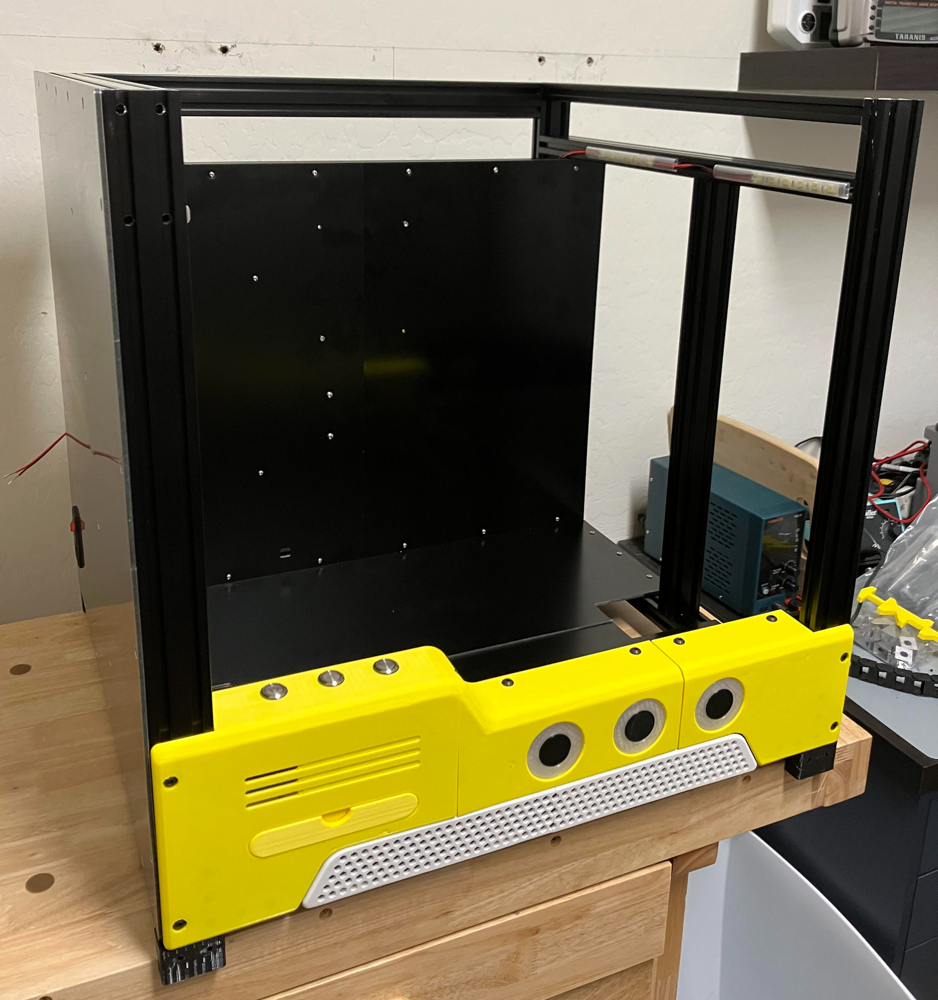

# "The WASP" - a BLV CoreXY printer build with MantaM8P and Klipper

This is a log of my BLV mgn cube 3d Printer.

I am building the the FYSETC kit with Bluerolls metal kit recommended by Ben Levi. 

This guide combines the build guides from Ben Levi, FYSETC, and David Husolo's guide on [ifixit](https://www.ifixit.com/Device/BLV_MGN_Cube) to provide a build flow that I followed to assemble my BLV printer. It's not the ONLY way to accomplish the build, it's simply a log of how I worked my way thru the build. 

## My build includes the following mods:

1. Klipper firmware running on a BTT Manta M8P with a CB1 raspberry pi clone
2. Induction probe using the probe port available on the Manta board
3. Neopixels controlled by the Manta board

## STL files
1. Bigtreetech H2 extruder/hermit crab mount adapted to the metal kit 
2. Adapter mount plate from the Duet mounting holes to the Manta M8P board
3. TPU mounting feet
4. Redesigned LED light strip diffusers
5. Redesigned LED neopixel diffusers

## Manta M8P-CB1 firmware
** Firmware

## Configuration Checks
Stepper motor direction setup (voron site).png
